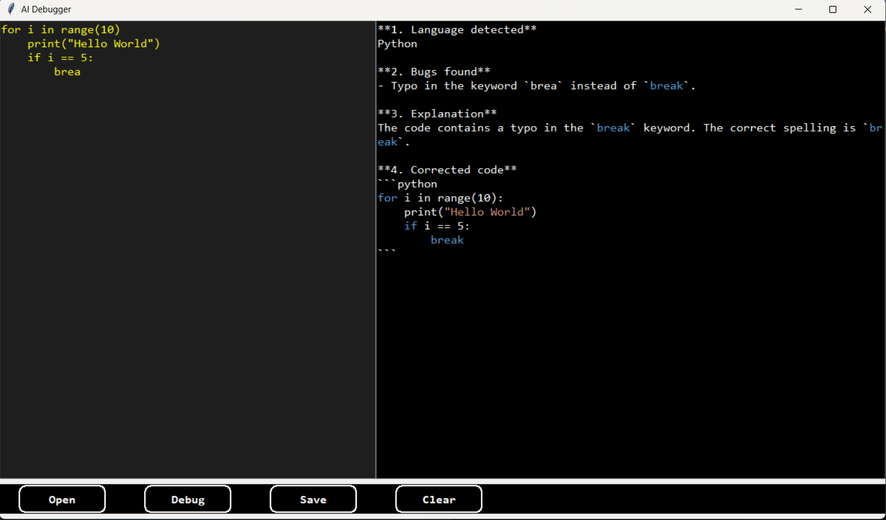

# AI Debugger (Local LLM Code Assistant)

AI-powered local code debugging tool built with **Python, Tkinter, and Ollama**.

Debug and explain code using a **locally running LLM**.


---

## Demo



This application allows developers to analyze, debug, and explain code
using a **locally running Large Language Model (LLM)**.

The project demonstrates how to integrate:

-   Desktop GUI applications
-   Local AI models
-   Streaming AI responses
-   Code analysis tools

------------------------------------------------------------------------

# Features

-   Local AI debugging assistant
-   Works completely **offline**
-   Debug **selected code or entire file**
-   Syntax highlighting using **Pygments**
-   Streaming AI responses
-   Code explanation feature
-   File open and save support
-   Custom Tkinter UI with rounded buttons

------------------------------------------------------------------------

# Tech Stack

-   Python
-   Tkinter
-   Ollama
-   CodeGemma (or any supported LLM)
-   Pygments

------------------------------------------------------------------------

# Project Structure

    AI-Debugger
    │
    ├── AI-Debugger.py
    ├── preview.mp4
    ├── README.md
    └── .gitignore

------------------------------------------------------------------------

# Installation

## 1 Install Python Libraries

``` bash
pip install ollama pygments
```

------------------------------------------------------------------------

## 2 Install Ollama

Download and install Ollama:

https://ollama.com/download

Verify installation:

``` bash
ollama --version
```

------------------------------------------------------------------------

## 3 Install the Model

Pull the model used in the project:

``` bash
ollama pull codegemma:7b
```

------------------------------------------------------------------------

# Running the Application

Run the script:

``` bash
python AI-Debugger.py
```

The application interface contains:

Left panel\
→ Code editor

Right panel\
→ AI output

Bottom toolbar\
→ Tools

Buttons available:

  Button    Function
  --------- ----------------------------
  Open      Load a code file
  Debug     AI analyzes and fixes bugs
  Explain   AI explains the code
  Save      Save AI output
  Clear     Clear the output window

------------------------------------------------------------------------

# Debug Feature

1.  Paste code into the editor
2.  Select lines *(optional)*
3.  Click **Debug**

The AI returns:

1.  Language detected\
2.  Bugs found\
3.  Explanation\
4.  Corrected code

------------------------------------------------------------------------

# Explain Feature

1.  Paste or open code
2.  Select lines *(optional)*
3.  Click **Explain**

The AI returns:

1.  Language detected\
2.  Code summary\
3.  Detailed explanation\
4.  Expected output

------------------------------------------------------------------------

# Using Another Model

The script currently uses:

``` python
model="codegemma:7b"
```

You can replace it with **any Ollama-supported model**.

Examples:

    deepseek-coder
    codellama
    llama3
    mistral

Example modification:

``` python
model="deepseek-coder"
```

Pull the model before running:

``` bash
ollama pull deepseek-coder
```

------------------------------------------------------------------------

# Future Improvements

Possible upgrades:

-   Multi-language syntax highlighting
-   Integrated terminal
-   Error line highlighting
-   Multiple file tabs
-   Theme support
-   Model selection dropdown

------------------------------------------------------------------------

# Author

Arman Mittal\
GitHub: Arman471-byte

------------------------------------------------------------------------

# License

MIT License

